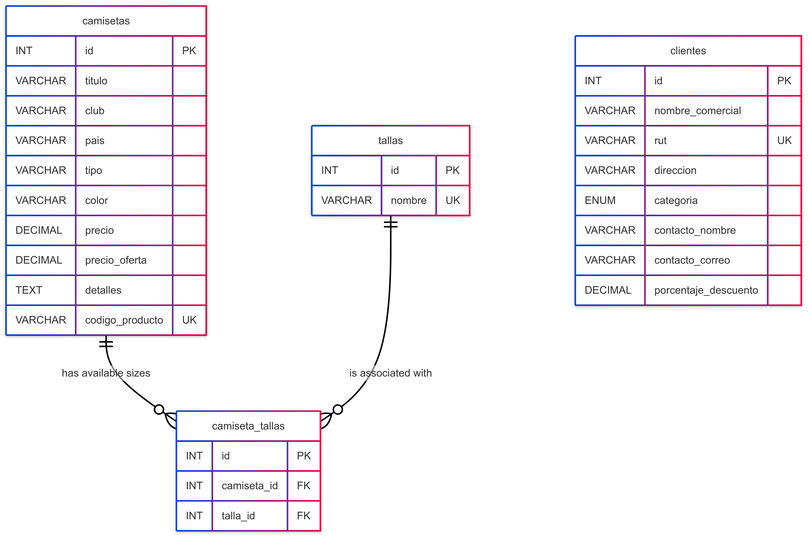

## 1. Introducción

El presente documento describe el desarrollo de una API RESTful implementada en PHP puro, con conexión a base de datos MySQL mediante PDO, orientada a la gestión de camisetas, clientes y tallas para una tienda mayorista. La solución fue desarrollada utilizando XAMPP, Thunder Client y siguiendo principios REST para el diseño de rutas y manejo de recursos.

---
## 2. Arquitectura del Proyecto

**Estructura de carpetas del backend:**

/todoCamisetas-api

├── config/

│ └── database.php

├── controllers/

│ ├── CamisetaController.php

│ ├── ClienteController.php

│ └── TallaController.php

├── models/

│ ├── Camiseta.php

│ ├── Cliente.php

│ └── Talla.php

├── routes/

│ └── index.php

├── utils/

│ └── response.php

├── .htaccess

└── index.php

**Descripción general:**

- `config/`: contiene la conexión PDO a la base de datos.

- `models/`: contiene la lógica SQL (CRUD) para cada entidad.

- `controllers/`: maneja la lógica de negocio y validaciones.

- `routes/`: enruta solicitudes a los controladores mediante expresiones regulares.

- `utils/`: funciones auxiliares para devolver respuestas JSON estandarizadas.

- `.htaccess`: permite la redirección a `index.php` para URLs amigables.

- `index.php`: punto de entrada único de la API.

---
## 3. Base de Datos y Relaciones

- Motor: **MySQL**

- Nombre de la base de datos: `todo_camisetas`

- Entidades: `clientes`, `camisetas`, `tallas`, `camiseta_tallas`

- Relaciones:

  - Cliente ⬄ Camiseta: *lógica indirecta para precio final*

  - Camiseta ⬄ Talla: relación muchos a muchos

 **Diagrama Entidad-Relación:** 


---

 ## 4. Endpoints RESTful

La API fue desarrollada bajo principios REST, utilizando el ID como parámetro en la URL para identificar recursos.

✅ Todos los endpoints devuelven `Content-Type: application/json`.

📝 Documentación completa:  

[Ver tabla de endpoints completa aquí](-docs/endpoints.md)

##  Documentación OpenAPI (Swagger)

La documentación completa de los endpoints, parámetros, request/response y códigos de estado fue generada utilizando el estándar OpenAPI 3.0 y se encuentra disponible en el siguiente archivo:

📄 [`swagger.yaml`](swagger.yaml)

Se puede visualizar utilizando herramientas como [Swagger Editor](https://editor.swagger.io/) o Swagger UI.

Opcionalmente, puede ser convertido a HTML o documentado con Swagger Viewer en VSCode.


---

## 🧩 5. Lógica de Negocio -- `precio_final`

El endpoint:

GET /camisetas/{id}/cliente/{cliente_id}

Implementa la lógica:

- Si el cliente es **Preferencial** y existe `precio_oferta` → usarlo.

- Se aplica el `porcentaje_descuento` del cliente sobre el precio base.

- Si no hay oferta o es cliente Regular → usar `precio`.

**Ejemplo de respuesta:**

```json

{

  "titulo": "Camiseta Local 2025 -- Chile",

  "cliente_categoria": "Preferencial",

  "precio_base": 40000,

  "precio_final": 36000

}

🧪 6. Pruebas y Colección Thunder Client

Se realizaron pruebas de:

CRUD completo para camisetas, clientes y tallas.

Asignación de tallas a camisetas.

Lógica de precio_final validada con distintos tipos de clientes.

Respuestas ante errores comunes (400, 404, etc.)

📦 Archivo adjunto: coleccion_thunderclient.json

📦 7. Entrega Final

Todos los archivos fueron empaquetados y entregados en un archivo .zip con el siguiente contenido:

/todoCamisetas-api (código completo)

informe.md (este documento)

coleccion_thunderclient.json

diagrama_ER.png

📁 Nombre del archivo:

Eval_U3A_Cabello_Bustamante_Gomez.zip

✔️ 8. Conclusión

El proyecto cumple con todos los requisitos técnicos de la evaluación, entregando una API modular, funcional y con lógica de negocio optimizada. Se respetaron los principios REST, se utilizaron buenas prácticas de validación y se realizó documentación completa para facilitar el consumo desde frontend o herramientas de prueba.
